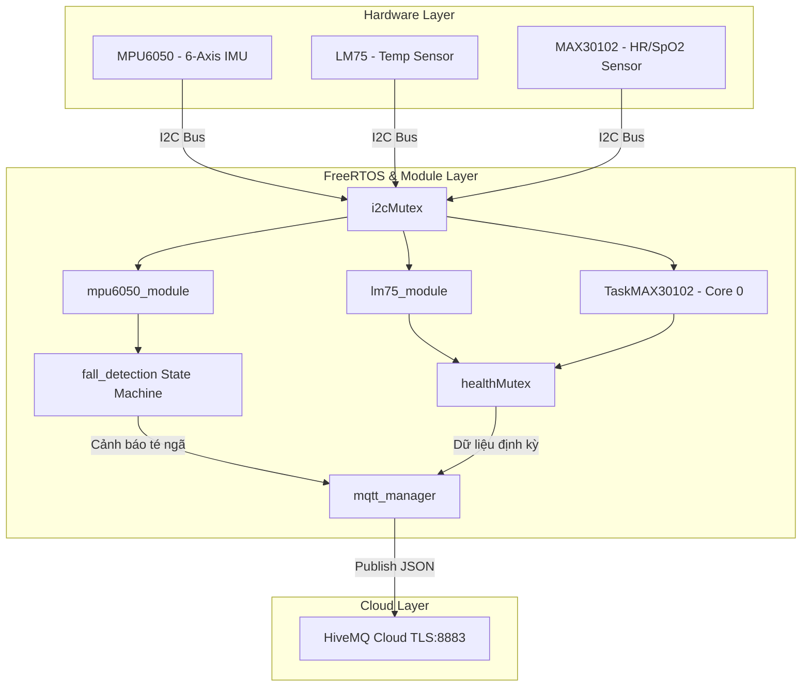

# Elder Care Firmware — ESP32-S3

Hệ thống nhúng giám sát sức khỏe và phát hiện té ngã cho người cao tuổi sử dụng vi điều khiển **ESP32-S3**. Dữ liệu từ các cảm biến được thu thập, xử lý theo thời gian thực và tự động gửi lên hạ tầng đám mây (Cloud) qua giao thức **MQTT (TLS/SSL)**.

---

## 📌 Tính năng chính

1. **Phát hiện té ngã tự động (Fall Detection)**:
   - Thuật toán State Machine 5 pha dựa trên cảm biến gia tốc và con quay hồi chuyển 6 trục (**MPU6050**).
   - Nhận biết các giai đoạn: Rơi tự do (Free Fall) ➔ Va chạm (Impact) ➔ Đứng yên bất động (Stillness).
   - Phát cảnh báo khẩn cấp tức thì lên Cloud.

2. **Đo chỉ số sinh hiệu (Health Monitoring)**:
   - **Nhịp tim (HR) & Độ bão hòa Oxy trong máu (SpO2)**: Sử dụng cảm biến quang học **MAX30102** kết hợp thuật toán lọc nhiễu median và cửa sổ trượt (sliding window) chạy trên **FreeRTOS Task** độc lập.
   - **Nhiệt độ cơ thể**: Đọc từ cảm biến nhiệt độ I2C **LM75**.

3. **Kết nối & Đảm bảo an toàn dữ liệu**:
   - Tự động quét và kết nối WiFi 2.4GHz.
   - Gửi dữ liệu định dạng JSON tới MQTT Broker (HiveMQ Cloud - TLS Port 8883).
   - Cơ chế tự kết nối lại (Auto Reconnect) khi mất kết nối mạng hoặc Broker.
   - Thread-safe tuyệt đối nhờ cơ chế đồng bộ `Mutex` của FreeRTOS.

---

## 🏗 Cấu trúc Module Code

Dự án được phân tách thành các module chức năng độc lập, dễ dàng bảo trì và tái sử dụng:

```text
elder_care/src/
├── config.h               # Tập trung toàn bộ cấu hình, chân Pin, thông số WiFi/MQTT, ngưỡng thuật toán
├── shared_state.h/.cpp    # Struct dữ liệu chung (HealthData, SensorData), Mutex và các cờ trạng thái
├── mpu6050_module.h/.cpp  # Khởi tạo và đọc dữ liệu MPU6050 (Áp dụng lọc EMA)
├── lm75_module.h/.cpp     # Quét I2C và đọc nhiệt độ cơ thể từ LM75
├── max30102_module.h/.cpp # FreeRTOS Task (Core 0) tính toán HR/SpO2 từ MAX30102
├── fall_detection.h/.cpp  # State machine 5 pha phát hiện té ngã
├── mqtt_manager.h/.cpp    # Quản lý WiFi, TLS MQTT client và đóng gói JSON publish
└── main.cpp               # Điểm vào chương trình (setup & loop tối giản)
```

---

## 🛠 Sơ đồ kiến trúc phần mềm



---

## 🔌 Cấu hình phần cứng & Chân kết nối (Pinout)

* **Board vi điều khiển**: ESP32-S3 SuperMini (Flash 4MB)
* **Chuẩn giao tiếp**: I2C (Bus dùng chung cho cả 3 cảm biến)
  * **SDA**: Pin 8
  * **SCL**: Pin 9

### Địa chỉ I2C của các thiết bị:
- **MPU6050**: `0x68`
- **MAX30102**: `0x57`
- **LM75**: Quét tự động trong dải `0x48` – `0x4F`

---

## 📦 Định dạng dữ liệu MQTT Payload

Dữ liệu được đẩy lên chủ đề (Topic) `eldercare/test_nga` dưới dạng JSON:

```json
{
  "ten": "Ong Nguyen Van A",
  "nhip_tim": 75,
  "spo2": 98,
  "nhiet_do": 36.62,
  "canh_bao": "Binh thuong",
  "ax": 0.02,
  "ay": -0.05,
  "az": 0.98,
  "gx": 0.1,
  "gy": -0.3,
  "gz": 0.0
}
```

*Trường `canh_bao` sẽ chuyển thành `"Phat hien te nga khan cap"` khi phát hiện sự cố té ngã.*

---

## 🚀 Hướng dẫn Biên dịch & Nạp Firmware

Dự án được quản lý bằng **PlatformIO**.

### Yêu cầu môi trường:
- [Visual Studio Code](https://code.visualstudio.com/) + Extension [PlatformIO IDE](https://platformio.org/)
- Hoặc PlatformIO CLI.

### Các bước thực hiện:

1. **Clone / Mở thư mục dự án**:
   Mở thư mục `elder_care` trong VS Code.

2. **Cấu hình thông số (Nếu cần)**:
   Mở file [`src/config.h`](file:///c:/Users/ADMIN/Downloads/elder_care_firmware/elder_care/src/config.h) để thay đổi:
   - `WIFI_SSID` & `WIFI_PASSWORD`
   - `MQTT_HOST`, `MQTT_USER`, `MQTT_PASS`

3. **Biên dịch (Build)**:
   ```bash
   pio run -e esp32-s3
   ```

4. **Nạp Firmware (Upload)**:
   ```bash
   pio run -e esp32-s3 -t upload
   ```

5. **Theo dõi Serial Monitor**:
   ```bash
   pio device monitor -b 115200
   ```
