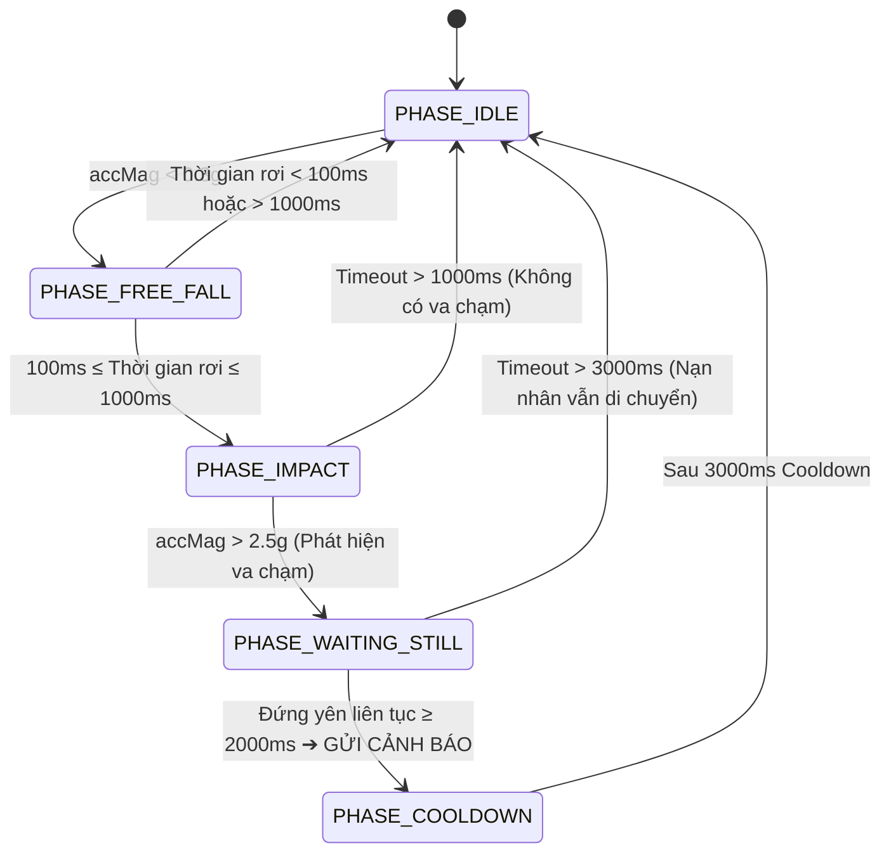
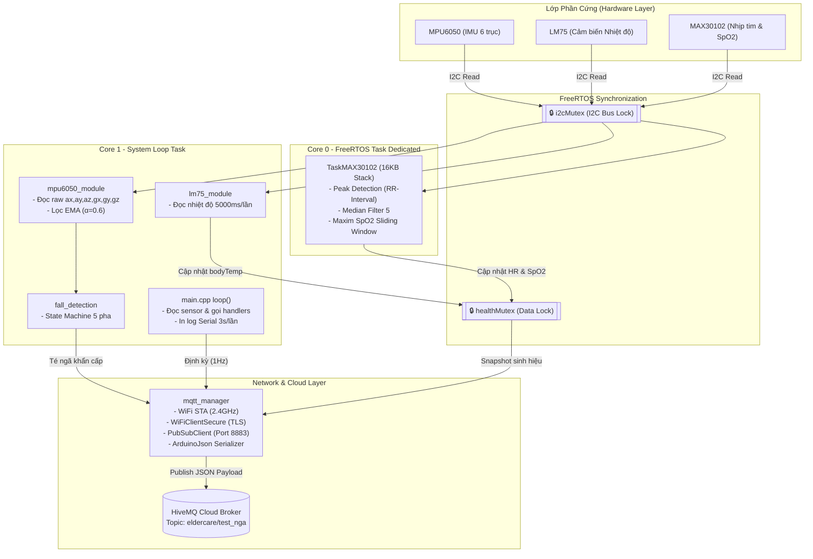

# Elder Care Firmware — ESP32-S3 IoT System

Hệ thống nhúng giám sát sức khỏe toàn diện và tự động phát hiện té ngã dành cho người cao tuổi, dựa trên vi điều khiển **ESP32-S3**. Dữ liệu cảm biến được thu thập, xử lý theo thời gian thực (Real-time), phân tích qua các thuật toán DSP/State Machine và truyền tải an toàn lên hạ tầng đám mây (Cloud) qua giao thức **MQTT (TLS/SSL)**.

---

## 📋 MỤC LỤC
1. [Tính năng nổi bật](#-tính-năng-nổi-bật)
2. [Chi tiết thuật toán xử lý](#-chi-tiết-thuật-toán-xử-lý)
   - [Thuật toán phát hiện té ngã (5-Phase State Machine)](#1-thuật-toán-phát-hiện-té-ngã-5-phase-state-machine)
   - [Thuật toán đo Nhịp tim & SpO2 (MAX30102 DSP Task)](#2-thuật-toán-đo-nhịp-tim--spo2-max30102-dsp-task)
   - [Đo nhiệt độ cơ thể (LM75 I2C Polling)](#3-đo-nhiệt-độ-cơ-thể-lm75-i2c-polling)
3. [Kiến trúc đa nhiệm & Thread Safety](#-kiến-trúc-đa-nhiệm--thread-safety)
4. [Cấu trúc Module Code](#-cấu-trúc-module-code)
5. [Sơ đồ kiến trúc phần mềm](#-sơ-đồ-kiến-trúc-phần-mềm)
6. [Cấu hình phần cứng & Sơ đồ chân (Pinout)](#-cấu-hình-phần-cứng--sơ-đồ-chân-pinout)
7. [Định dạng dữ liệu MQTT JSON Payload](#-định-dạng-dữ-liệu-mqtt-json-payload)
8. [Hướng dẫn cài đặt & Biên dịch](#-hướng-dẫn-cài-đặt--biên-dịch)

---

## 📌 TÍNH NĂNG NỔI BẬT

* **Phát hiện té ngã khẩn cấp**: Sử dụng cảm biến gia tốc và con quay hồi chuyển 6 trục MPU6050 để nhận diện cú ngã theo thời gian thực với độ chính xác cao, giảm thiểu báo động giả.
* **Đo sinh hiệu liên tục**:
  * Nhịp tim (Heart Rate - BPM) và Nồng độ Oxy trong máu (SpO2 - %) thông qua cảm biến quang học MAX30102.
  * Nhiệt độ cơ thể (°C) thông qua cảm biến nhiệt độ LM75.
* **Kết nối IoT Bảo mật**:
  * Tự động quét và duy trì kết nối WiFi 2.4GHz với cơ chế tự khôi phục (Auto-reconnect).
  * Kết nối tới HiveMQ Cloud Broker qua cổng bảo mật TLS/SSL (`8883`).
  * Sinh Client ID ngẫu nhiên cho từng thiết bị để tránh xung đột kết nối.
* **Tối ưu hóa đa nhân ESP32-S3 (Dual-Core)**:
  * Đạt hiệu năng cao nhờ phân chia công việc: **Core 0** dành riêng cho xử lý tín hiệu nặng (DSP SpO2/HR), **Core 1** chạy vòng lặp giám sát hệ thống (`loop`).
  * Sử dụng **FreeRTOS Mutex** để bảo vệ tài nguyên bus I2C và biến dữ liệu dùng chung.

---

## 🔬 CHI TIẾT THUẬT TOÁN XỬ LÝ

### 1. Thuật toán phát hiện té ngã (5-Phase State Machine)

Thuật toán hoạt động dựa trên mô hình máy trạng thái 5 pha kết hợp lọc trung bình động lũy thừa (EMA Filter):
- **Công thức tính độ lớn tổng (Magnitude)**:
  $$\text{accMag} = \sqrt{a_x^2 + a_y^2 + a_z^2} \quad (g)$$
  $$\text{gyroMag} = \sqrt{g_x^2 + g_y^2 + g_z^2} \quad (^\circ/s)$$
- **Lọc EMA (Alpha = 0.6)**:
  $$\text{filtered\_accMag} = 0.4 \times \text{filtered\_accMag} + 0.6 \times \text{accMag}$$

#### 🔄 Các pha trạng thái:



| Thông số cấu hình | Giá trị | Ý nghĩa |
|---|---|---|
| `FREE_FALL_THRESHOLD` | `0.3f` g | Ngưỡng nhận biết cơ thể bắt đầu rơi tự do |
| `IMPACT_THRESHOLD` | `2.5f` g | Ngưỡng nhận biết va chạm mạnh với mặt đất |
| `STILL_ACC_THRESHOLD` | `0.15f` g | Ngưỡng biến thiên gia tốc để xác định người nằm yên |
| `STILL_GYRO_THRESHOLD` | `20.0f` °/s | Ngưỡng tốc độ góc để xác định không xoay người |
| `STILL_DURATION_MS` | `2000` ms | Thời gian nằm yên tối thiểu sau va chạm để xác nhận té ngã |

---

### 2. Thuật toán đo Nhịp tim & SpO2 (MAX30102 DSP Task)

Xử lý tín hiệu cảm biến quang học MAX30102 được cô lập hoàn toàn trong một **FreeRTOS Task** (`TaskMAX30102`) với Stack size 16KB chạy trên Core 0.

#### 💡 Quy trình xử lý tín hiệu:
1. **Kiểm tra sự có mặt ngón tay**: So sánh cường độ tia hồng ngoại $IR > 30000$. Nếu không có ngón tay, hệ thống lập tức xóa buffer và reset chỉ số về `-1`.
2. **Khởi tạo Buffer mẫu (Sliding Window)**: Thu thập đủ 100 mẫu dữ liệu Hồng ngoại (IR) và Đỏ (Red) ở tần số 100Hz.
3. **Phân tích nhịp tim theo thời gian thực (RR-Interval)**:
   - Phát hiện đỉnh xung (Peak Detection) trên dòng dữ liệu IR.
   - Tính khoảng thời gian giữa 2 nhịp đập liên tiếp ($\Delta t_{RR}$). Ngưỡng chấp nhận: $300\text{ms} \le \Delta t_{RR} \le 1500\text{ms}$ (tương đương 40 – 200 BPM).
   - Lọc Median 5 mẫu gần nhất để loại bỏ các nhịp nhiễu đột biến.
4. **Tính nồng độ SpO2 (Maxim Algorithm)**:
   - Tính tỉ lệ $R = \frac{(AC_{red}/DC_{red})}{(AC_{ir}/DC_{ir})}$.
   - Áp dụng công thức Maxim SpO2 để trích xuất tỷ lệ bão hòa Oxy.
   - Cập nhật buffer định kỳ theo cơ chế cửa sổ trượt: Bỏ 25 mẫu cũ nhất và đọc bổ sung 25 mẫu mới.

---

### 3. Đo nhiệt độ cơ thể (LM75 I2C Polling)

- Cảm biến nhiệt độ LM75 được truy vấn định kỳ mỗi **5000ms**.
- Đọc giá trị 16-bit từ thanh ghi `0x00`, dịch 5 bit (định dạng 11-bit Two's Complement).
- Độ phân giải: **0.125°C / LSB**.

---

## ⚡ KIẾN TRÚC ĐA NHỆM & THREAD SAFETY

Để tránh tranh chấp tài nguyên phần cứng I2C và đảm bảo tính toàn vẹn dữ liệu khi đọc/ghi ở các Core khác nhau, hệ thống áp dụng 2 Semaphore Mutex của FreeRTOS:

1. **`i2cMutex`**:
   - Bảo vệ bus I2C dùng chung giữa 3 cảm biến MPU6050, MAX30102 và LM75.
   - Mọi thao tác đọc/ghi thanh ghi I2C đều bắt buộc phải lấy `i2cMutex` trước khi giao tiếp.

2. **`healthMutex`**:
   - Bảo vệ struct dữ liệu `HealthData` (chứa `heartRate`, `spo2`, `bodyTemp`).
   - Ghi dữ liệu từ `TaskMAX30102` (Core 0) và `handleLM75()` (Core 1).
   - Đọc dữ liệu từ vòng lặp `loop()` và hàm đóng gói gửi MQTT `sendDataToCloud()`.

---

## 🏗 CẤU TRÚC MODULE CODE

Mã nguồn được thiết kế theo nguyên tắc **Single Responsibility Principle (SRP)** và **Encapsulation**:

```text
.
├── platformio.ini         # Cấu hình biên dịch PlatformIO cho ESP32-S3 (4MB Flash, USB CDC)
├── README.md              # Tài liệu chi tiết dự án
└── src/
    ├── config.h               # Tập trung toàn bộ #define (Pin, Wi-Fi, MQTT, Ngưỡng thuật toán)
    ├── shared_state.h         # Khai báo Struct dữ liệu, biến toàn cục extern, Mutex & Utility
    ├── shared_state.cpp       # Định nghĩa bộ nhớ cho các biến toàn cục
    ├── mpu6050_module.h/.cpp  # Khởi tạo MPU6050, đọc gia tốc/gyro & lọc EMA
    ├── lm75_module.h/.cpp     # Scan địa chỉ I2C (0x48..0x4F) & đọc nhiệt độ LM75
    ├── max30102_module.h/.cpp # FreeRTOS Task đo nhịp tim, SpO2 & thuật toán lọc Median
    ├── fall_detection.h/.cpp  # State machine 5 pha phát hiện té ngã
    ├── mqtt_manager.h/.cpp    # Quản lý WiFi, kết nối TLS MQTT & đóng gói JSON publish
    └── main.cpp               # Hàm setup() khởi tạo và loop() điều phối gọn nhẹ (~70 dòng)
```

### 📄 Mô tả nhiệm vụ chi tiết của từng Module:

| Module | Tệp tin | Nhiệm vụ chính |
|---|---|---|
| **Config** | [`src/config.h`](file:///c:/Users/ADMIN/Downloads/elder_care_firmware/src/config.h) | Chứa tất cả các hằng số `#define`: chân SDA/SCL, thông số WiFi, TLS MQTT, các ngưỡng gia tốc/thời gian té ngã, cấu hình MAX30102 và LM75. |
| **Shared State** | [`src/shared_state.h`](file:///c:/Users/ADMIN/Downloads/elder_care_firmware/src/shared_state.h)<br>[`src/shared_state.cpp`](file:///c:/Users/ADMIN/Downloads/elder_care_firmware/src/shared_state.cpp) | Định nghĩa các struct `HealthData`, `SensorData`, `FilteredData`. Quản lý `healthMutex`, `i2cMutex` và các cờ trạng thái `wifiOk`, `mqttOk`. |
| **MPU6050** | [`src/mpu6050_module.h`](file:///c:/Users/ADMIN/Downloads/elder_care_firmware/src/mpu6050_module.h)<br>[`src/mpu6050_module.cpp`](file:///c:/Users/ADMIN/Downloads/elder_care_firmware/src/mpu6050_module.cpp) | Ẩn đối tượng `MPU6050` trong cpp scope. Thực hiện quy đổi đơn vị thô ra $g$ và $^\circ/s$, tính vector gia tốc tổng và áp dụng lọc EMA. |
| **LM75** | [`src/lm75_module.h`](file:///c:/Users/ADMIN/Downloads/elder_care_firmware/src/lm75_module.h)<br>[`src/lm75_module.cpp`](file:///c:/Users/ADMIN/Downloads/elder_care_firmware/src/lm75_module.cpp) | Tự động quét tìm địa chỉ I2C của LM75 trong dải `0x48`–`0x4F`, đọc giá trị thanh ghi nhiệt độ theo chu kỳ 5 giây. |
| **MAX30102** | [`src/max30102_module.h`](file:///c:/Users/ADMIN/Downloads/elder_care_firmware/src/max30102_module.h)<br>[`src/max30102_module.cpp`](file:///c:/Users/ADMIN/Downloads/elder_care_firmware/src/max30102_module.cpp) | Khởi tạo cảm biến MAX30102, chạy `TaskMAX30102` trên Core 0. Thực hiện lọc Median 5 phần tử cho nhịp tim và cửa sổ trượt SpO2. |
| **Fall Detection** | [`src/fall_detection.h`](file:///c:/Users/ADMIN/Downloads/elder_care_firmware/src/fall_detection.h)<br>[`src/fall_detection.cpp`](file:///c:/Users/ADMIN/Downloads/elder_care_firmware/src/fall_detection.cpp) | Thực thi máy trạng thái 5 pha (IDLE ➔ FREE_FALL ➔ IMPACT ➔ WAITING_STILL ➔ COOLDOWN). Kích hoạt lệnh gửi cảnh báo khẩn cấp khi xác nhận té ngã. |
| **MQTT Manager** | [`src/mqtt_manager.h`](file:///c:/Users/ADMIN/Downloads/elder_care_firmware/src/mqtt_manager.h)<br>[`src/mqtt_manager.cpp`](file:///c:/Users/ADMIN/Downloads/elder_care_firmware/src/mqtt_manager.cpp) | Quản lý kết nối WiFi STA (quét mạng 2.4GHz), TLS Socket với `WiFiClientSecure`, tạo kết nối MQTT bảo mật, tự động reconnect và serialize dữ liệu JSON bằng `ArduinoJson`. |
| **Main Entry** | [`src/main.cpp`](file:///c:/Users/ADMIN/Downloads/elder_care_firmware/src/main.cpp) | Đơn giản hóa điểm vào hệ thống. Hàm `setup()` khởi tạo tuần tự các module; hàm `loop()` điều phối đọc cảm biến, gọi state machine và in log định kỳ. |

---

## 🛠 SƠ ĐỒ KIẾN TRÚC PHẦN MỀM



---

## 🔌 CẤU HÌNH PHẦN CỨNG & SƠ ĐỒ CHÂN (PINOUT)

* **Vi điều khiển**: ESP32-S3 SuperMini (Bộ nhớ Flash 4MB, USB CDC Native).
* **Giao tiếp I2C**: Bus I2C duy nhất dùng chung cho cả 3 cảm biến.

| Chức năng | Chân ESP32-S3 Pin | Ghi chú |
|---|---|---|
| **I2C SDA** | **GPIO 8** | Chân dữ liệu I2C dùng chung |
| **I2C SCL** | **GPIO 9** | Chân xung Xung nhịp I2C dùng chung |
| **USB CDC** | USB-C Port | Nối trực tiếp với cổng USB CDC của chip S3 (Serial Log) |

### 📍 Địa chỉ I2C thiết bị:
- **MPU6050**: `0x68`
- **MAX30102**: `0x57`
- **LM75**: Địa chỉ mặc định `0x48` (Tự động quét trong dải `0x48` – `0x4F`)

---

## 📦 ĐỊNH DẠNG DỮ LIỆU MQTT JSON PAYLOAD

Mọi dữ liệu sinh hiệu và cảm biến được đóng gói thành chuỗi JSON và đẩy lên MQTT Topic **`eldercare/test_nga`**:

```json
{
  "ten": "Ong Nguyen Van A",
  "nhip_tim": 76,
  "spo2": 98,
  "nhiet_do": 36.62,
  "canh_bao": "Binh thuong",
  "ax": 0.02,
  "ay": -0.05,
  "az": 0.98,
  "gx": 0.10,
  "gy": -0.30,
  "gz": 0.00
}
```

### Giải thích các trường dữ liệu:
* `ten`: Tên định danh của người dùng/bệnh nhân.
* `nhip_tim`: Nhịp tim đo được (`BPM`), giá trị `-1` nếu chưa hợp lệ hoặc mất ngón tay.
* `spo2`: Nồng độ Oxy trong máu (`%`), giá trị `-1` nếu chưa hợp lệ.
* `nhiet_do`: Nhiệt độ cơ thể (`°C`), giá trị `-1.0` nếu chưa đọc được cảm biến.
* `canh_bao`: Trạng thái hệ thống:
  - `"Binh thuong"`: Trạng thái giám sát định kỳ.
  - `"Phat hien te nga khan cap"`: Cảnh báo kích hoạt tức thì khi xác nhận sự cố té ngã.
* `ax`, `ay`, `az`: Gia tốc 3 trục theo đơn vị $g$.
* `gx`, `gy`, `gz`: Tốc độ góc 3 trục theo đơn vị $^\circ/s$.

---

## 🚀 HƯỚNG DẪN CÀI ĐẶT & BIÊN DỊCH

Dự án được xây dựng và quản lý bằng **PlatformIO IDE**.

### 1. Yêu cầu phần mềm
- [Visual Studio Code](https://code.visualstudio.com/)
- Extension [PlatformIO IDE](https://marketplace.visualstudio.com/items?itemName=platformio.platformio-ide)
- Git Command Line Tool

### 2. Tải mã nguồn về máy
```bash
git clone https://github.com/ninht365/ESP32-Fall-Detection-IoT.git
cd ESP32-Fall-Detection-IoT
```

### 3. Mở dự án trong VS Code
Mở VS Code ➔ Chọn **File** ➔ **Open Folder...** ➔ Chọn thư mục `ESP32-Fall-Detection-IoT` (Thư mục chứa file `platformio.ini`).

### 4. Thay đổi cấu hình mạng (Nếu cần)
Mở file [`src/config.h`](file:///c:/Users/ADMIN/Downloads/elder_care_firmware/src/config.h) để điều chỉnh các thông số kết nối:
```cpp
#define WIFI_SSID        "Tên_WiFi_Của_Bạn"
#define WIFI_PASSWORD    "Mật_Khẩu_WiFi"

#define MQTT_HOST        "7c533fddea754db19e6afd1e297cf2f8.s1.eu.hivemq.cloud"
#define MQTT_PORT        8883
#define MQTT_USER        "eldercare_device"
#define MQTT_PASS        "Nhom1@123456"
```

### 5. Biên dịch & Nạp code

* **Biên dịch dự án (Build)**:
  Bấm nút **Build (`✓`)** ở góc dưới thanh trạng thái của VS Code hoặc chạy lệnh:
  ```bash
  pio run -e esp32-s3
  ```

* **Nạp Firmware lên vi điều khiển (Upload)**:
  Cắm board ESP32-S3 qua cổng USB-C, bấm nút **Upload (`➔`)** hoặc chạy lệnh:
  ```bash
  pio run -e esp32-s3 -t upload
  ```

* **Mở Serial Monitor xem nhật ký hoạt động**:
  ```bash
  pio device monitor -b 115200
  ```
